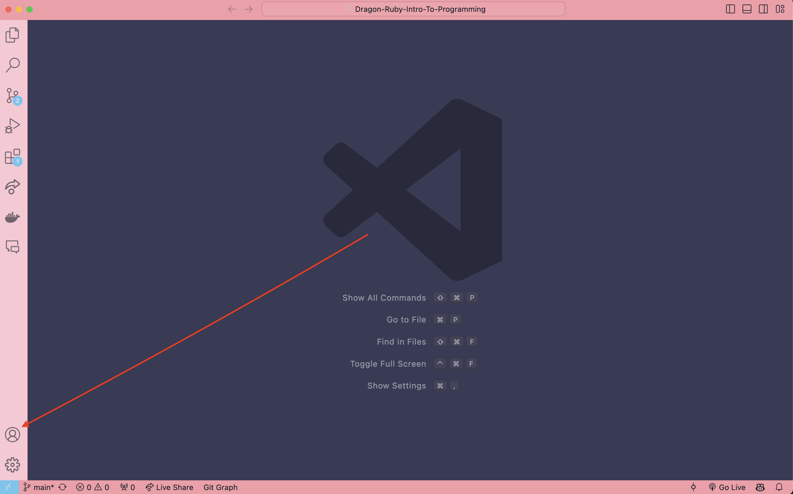
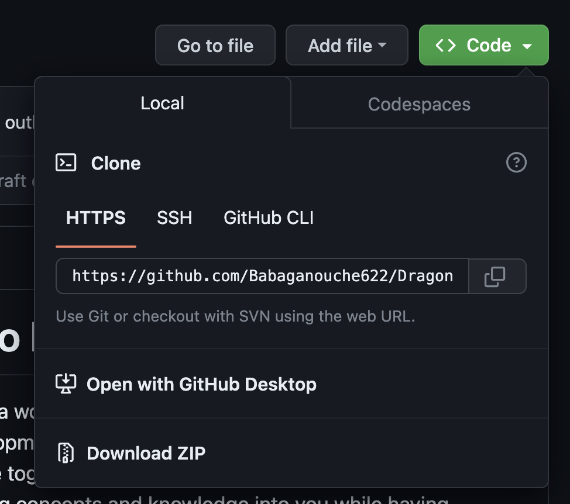

# Module 1
## Environment 

### Deliverables
- [ ] [Install VS Code](https://code.visualstudio.com/download)
- [ ] [Install Dragon Ruby Game Toolkit](https://dragonruby.org/toolkit/gam)
- [ ] [Set up GitHub account](https://github.com/)
- [ ] [Set up itch.io account](https://itch.io)
- [ ] [Connect GitHub to VS Code](account-location.png)
- [ ] [Clone this repo](https://github.com/Babaganouche622/Dragon-Ruby-Intro-To-Programming)
- [ ] Unzip the Dragon Ruby Game Toolkit into this repo locally
- [ ] Checkout onto a new branch
- [ ] Push this to GitHub

For our first section here it's all about getting our system up and running. We need 2 things to start:

- [VS Code](https://code.visualstudio.com/download)
- [The Dragon Ruby Game Toolkit](https://dragonruby.org/toolkit/game)

I am choosing for us all to work with VS Code because I'm assuming you aren't already familiar with another editor. However if you have an editor of preferance please by all means use it.

Next let's get accounts set up for [Github](https://github.com/) and [itch.io](https://itch.io). We'll need both of these to do our work so let's get our profiles all set up and connected.

Now that we have a Github account let's go ahead and lauch VS Code. We'll navigate to our user settings and log in to Github from VS Code to connect it with our new account.


I also want you to hit `cmd + shift + p`. This opens what is called the `Command Pallet`, just a spot where we can do some settings changes inside VS Code. All we will enter is:
```
Shell Command: Install 'code' command in PATH
```
And click the option that shows up here which should say exactly the same thing we just entered. This will enable us to launch VS Code from the terminal or the Command Line Interface (cli for short).

Now that we are connected to Github, let's go back to GitHub and [clone this Repository](https://github.com/Babaganouche622/Dragon-Ruby-Intro-To-Programming) so we can open this tutorial inside our SWEET new editor! Click on the link so we can navigate together to the main page of this repository. Here we are going to click the green button that says `< > Code ˇ` then click the copy button for the URL string.


Now let's open up our terminal, on your desktop create a new folder which we can call something like `projects`. This is just an easy spot for us to navigate to and store all our projects locally. Next right click on the folder and select `new terminal at folder`. This will open a new little black box window. I want you to now enter `git clone` then paste in the link we copied earlier. It should look something like: 
```
git clone https://github.com/Babaganouche622/Dragon-Ruby-Intro-To-Programming.git
```
Hit enter. Now if we open up our newly created folder on our desktop we should see another folder inside with all this content! Great job! We will get more familiar with our terminal this week and as we progress through this tutorial. So far you are doing excellent!

Now I want you to enter inside our terminal window `cd Dragon-Ruby-Intro-To-Programming` you will now see in the terminal that the bottom line has changed to be the name of our folder. What is `cd` and what did we just do? We are navigating through the cli into our project folder, or rather `changed directory` to our project folder. Don't worry too much about the terminal commands, I'll provide a cheat sheet with some exercises at the end of this module. 

Now that we have changed our directory, let's use our fancy new command we enabled earlier and enter `code .` in the terminal. This will now open a brand new VS Code editor for all of the contents of this directory, so our newly cloned repo. 


